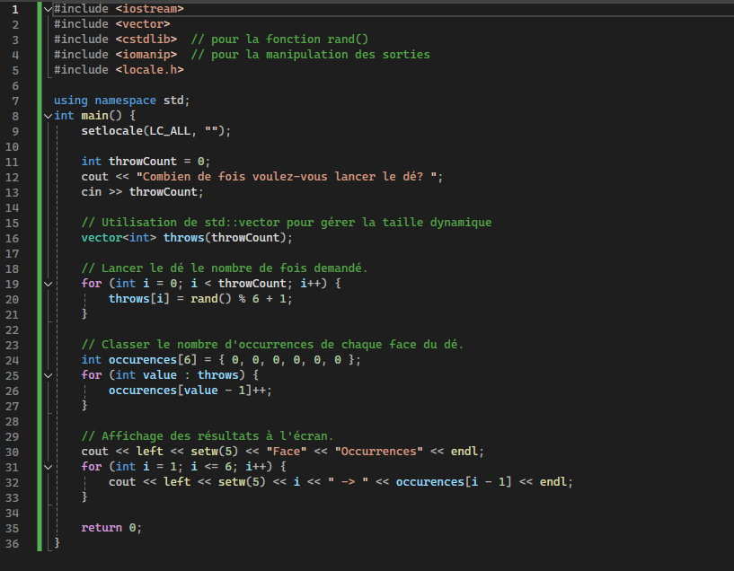

# Semaine 1
# Exercices (intro)

## Préambule
Créez un projet nommé `Exercices01` et ajoutez-y un fichier `Exercices01.cpp`. Pour chaque question, créez une fonction nommée `questionX_X` où X est le numéro de la question. Exemple `question2_1` pour la questions 2.1.  Appelez chaque fonction dans la fonction main.

#### Exemple :

```cpp
//Fonction pour la question 3.1
void question2_1() {
  cout endl << "Question 2.1" << endl;
  cout << "L'erreur est que..." << endl;
}

//On appelle les fonctions ici
int main() {
  question1();
  question2_1();
  question2_2();
  question2_3();
  //...
  return 0;
}
```

## Question 1 - Je m'exprime !

Dans le main de votre programme, faire **afficher** (cout) les résultats des éléments suivants un en dessous de l'autre. 

Rappel: si vous entrez une expression qui contient du texte, il faut mettre l'expression entre doubles guillemets (""). Il faut mettre un retour de ligne entre chaque sortie.
  - 34
  - "Je programme!"
  - 34 - 12
  - 4 * 9
  - 10 / 5
  - "J'écris ceci exprès pour la ponctuation française!"
  - (4+9)*10/2
  - 4+9*10/2

## Question 2 - Trouvez l'erreur!

Dans une fonction nommée `question2`, répondez en commentaire `//2.1 Il manque....` en indiquant l'erreur de syntaxe qui s'est glissée dans le code. Vous aurez souvent besoin d'inspecter à l'oeil, les erreurs ne sont pas toujours clairement indiquées par le compilateur. N'HÉSITEZ PAS à écrire le tout dans Visual Studio et à expérimenter!

### Question 2.1
```cpp
using namespace std;
int main() {
    cout <<"bonjour";
    return 0;
}
```
### Question 2.2
```cpp
#include <iostream>
using namespace std;
int main() {
    cout<< "bonjour"
    return 0;
}
```
### Question 2.3
```cpp
#include <iostream>
using namespace std;
int main() {
    cout "bonjour";
    return 0;
}
```
### Question 2.4
```cpp
#include <iostream>
using namespace std;
int main {
    cout<< "bonjour";
    return 0;
}
```
### Question 2.5
```cpp
#include <iostream>
using namespace std;
int main() {
    cout<< "bonjour"<<end;
    return 0;
}
```
### Question 2.6
```cpp 
#include <iostream>
int main() {
    cout<< 3 + 5;
    return 0;
}
```

## Question #3 - On joue aux dés!
L'objectif de ce dernier exercice est de vous familiariser avec la syntaxe de C++ et de trouver par vous-même l'emplacement de certains caractères spéciaux sur votre clavier.

Vous devez, dans cet exercice, ré-écrire au complet le programme suivant (pas de copier-coller) et ce, de façon à réussir à le faire fonctionner dans Visual Studio : 



<p align="Center"></p>
